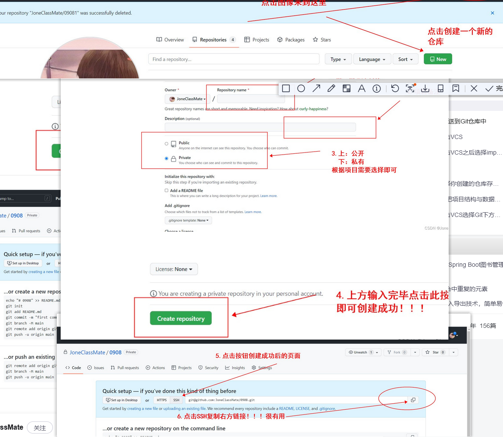
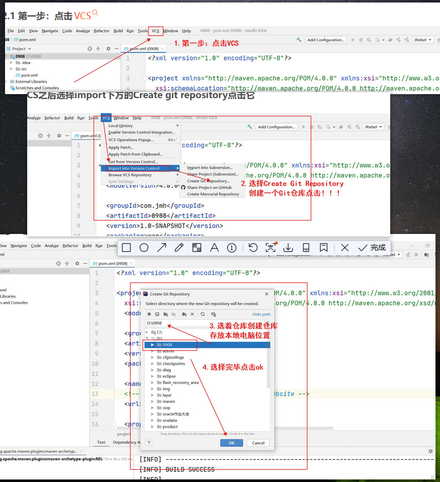
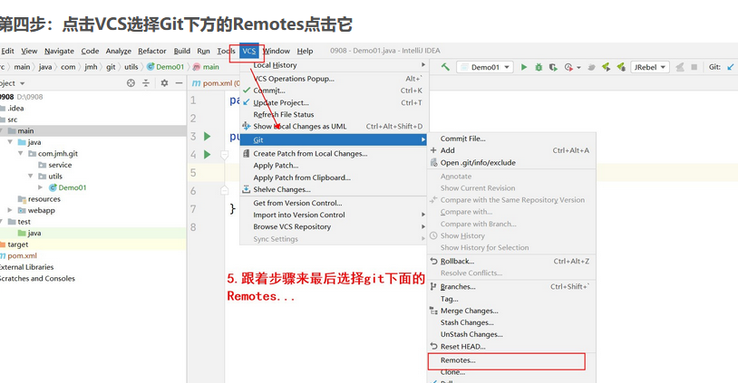
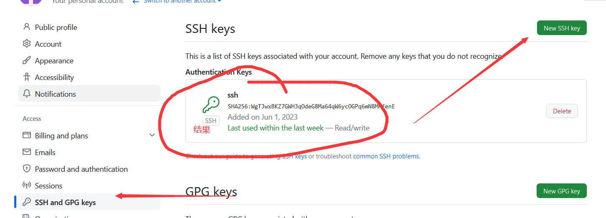
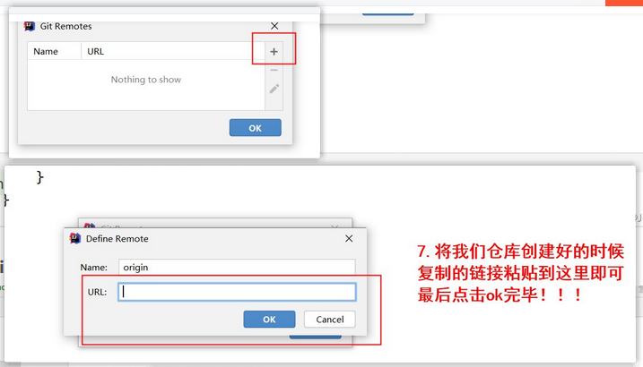

# 部署总结
### 一、 创建仓库

...注意保存ssh后的地址，配置远程数据需要用
### 创建本地项目
1. 创建项目并配置本地数据源

注意：此处的数据源设置为项目文件夹
2. 配置远程数据源

若此处报错，显示没有权限，则需要使用git工具生成ssh
3. git命令生成ssh
```text
ssh-keygen -t rsa -C "邮箱"
```
该命令生成pub文件，将其中的内容拷贝到github上

4.再添加远程数据源

最后commit-push项目文件即可